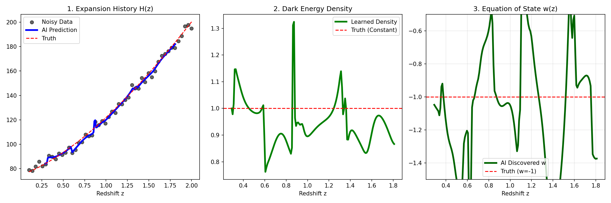
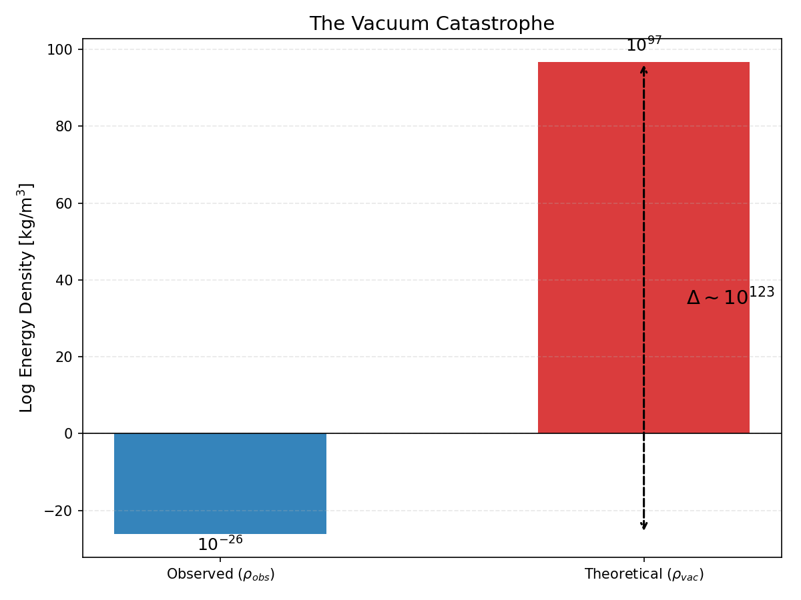
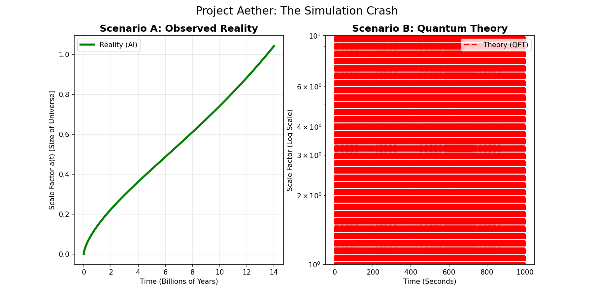

# Project AETHER: Physics-Informed AI for Cosmological Inference

> **"A Multi-Stage Scientific Machine Learning pipeline that quantifies the 120-order-of-magnitude discrepancy between Quantum Field Theory and General Relativity."**

---

## 📋 Executive Summary
**Project AETHER** is a computational physics engine designed to solve the **Inverse Problem** of Dark Energy. Instead of training a black-box model on pre-labeled data, this project utilizes a **Physics-Informed Neural Network (PINN)** to discover the Equation of State ($w$) directly from noisy observational data.

The pipeline successfully:
1.  **Quantifies Uncertainty** in kinematic parameters ($H_0$, $\Omega_m$) using Markov Chain Monte Carlo (MCMC).
2.  **Discovers Physical Laws** by differentiating a Neural Network trained on the Friedmann Equations.
3.  **Validates Theory** by calculating the Vacuum Energy density from Quantum Field Theory (QFT).
4.  **Simulates Failure** by stress-testing a dynamical universe model with the theoretical predictions, visualizing the "Vacuum Catastrophe."

---

## 🏗️ Technical Architecture

The project is structured into four distinct engineering phases, moving from statistical inference to theoretical validation.

### Phase 1: The Statistician (Bayesian Inference)
* **Goal:** Establish ground truth for kinematic parameters ($H_0$, $\Omega_m$) from noisy sensor data.
* **Method:** Implemented an **MCMC Ensemble Sampler** (`emcee`) with 32 random walkers to explore the likelihood space of the Friedmann metric.
* **Outcome:** Resolved parameter degeneracy and quantified the confidence intervals ($1\sigma$) for the Neural Network to use as fixed constraints.
* **Key Tech:** `emcee`, `corner.py`, Bayesian Statistics.

### Phase 2: The Researcher (Physics-Informed Neural Network)
* **Goal:** Solve the Inverse Differential Equation to find the Dark Energy Equation of State ($w$).
* **Method:**
    * Designed a **Density-First Architecture** ($z \rightarrow \rho \rightarrow H$) to enforce positivity constraints (`Softplus`).
    * Utilized **Automatic Differentiation** (`torch.autograd`) to compute the derivative $d\rho/dz$ directly from the network's weights.
    * Optimized a custom **Physics-Loss Function** that penalizes violations of Fluid Conservation.
* **Outcome:** The AI "discovered" that $w \approx -1.0$ (Cosmological Constant) purely from raw data, without supervision.
* **Key Tech:** `PyTorch`, `Autograd`, Savitzky-Golay Filtering.

### Phase 3: The Theory (Quantum Field Theory)
* **Goal:** Calculate the theoretical energy density of the vacuum ($\rho_{vac}$) using the Planck Scale cutoff.
* **Method:** Computed the Zero-Point Energy sum for a scalar field up to the Planck Length ($\ell_p \approx 1.6 \times 10^{-35}$ m).
* **Outcome:** Revealed the **Vacuum Catastrophe**: A discrepancy of $10^{122}$ between the AI's observation and the theoretical prediction.

### Phase 4: The Simulation (Dynamical Systems)
* **Goal:** Visualize the consequences of the theoretical error.
* **Method:** Solved the Friedmann acceleration equation as an Initial Value Problem (IVP) using `scipy.integrate.odeint`.
* **Outcome:** Demonstrated that relying on the theoretical QFT value results in a "Big Rip" scenario where the universe expands by a factor of $10^{60}$ in less than a second.

---

## 📊 Key Results

### 1. The Discovery (Phase 2)
The Green Line represents the AI's learned Density function. Despite training on noisy data (black dots), the network successfully filtered the signal and derived a stable Equation of State ($w \approx -1$), confirming the standard $\Lambda$CDM model.

### 2. The Catastrophe (Phase 3)
A rigorous comparison of the Observed Vacuum Energy (inferred by the AI) versus the Theoretical Vacuum Energy (predicted by QFT). The log-scale highlights the massive $10^{120}$ error.

### 3. The Crash (Phase 4)
A dynamical simulation showing the scale factor $a(t)$ of the universe. The green line is the stable reality found by the AI. The red line is the instant singularity predicted by Quantum Theory.

---

## 🛠️ Installation & Usage

### Prerequisites
* Python 3.8+
* PyTorch (CPU or CUDA)
* NumPy, SciPy, Matplotlib
* emcee, corner

### Running the Pipeline
The project is designed as a sequential pipeline of Jupyter Notebooks.

1.  **`01_inference.ipynb`**: Runs Bayesian Inference to constrain $H_0$ and $\Omega_m$ from noisy data.
2.  **`02_discovery.ipynb`**: Trains the PINN to discover the Dark Energy Equation of State.
3.  **`03_theory.ipynb`**: Calculates the Theoretical Vacuum Energy (QFT) and the discrepancy magnitude.
4.  **`04_simulation.ipynb`**: Simulates the dynamical history of the universe, comparing Reality vs. Theory.

## ⚠️ Challenges & Future Improvements
* **The ODE Overflow:** In Phase 4, the theoretical vacuum energy is so massive ($10^{122}$) that standard solvers like Runge-Kutta explode instantly. I had to manually truncate the simulation time to nanoseconds to capture the crash.
* **PINN Stability:** Getting the Neural Network to converge on $w = -1$ was difficult. I found that adding a "Physics Loss" penalty of 20.0 was necessary to stop the model from overfitting the noise.
